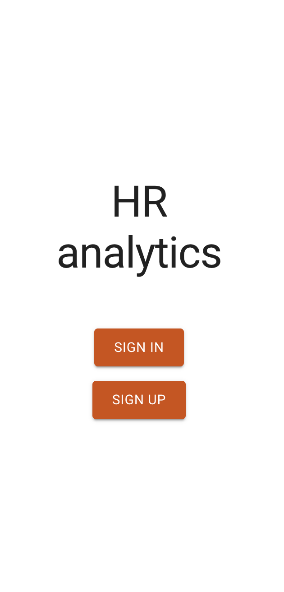
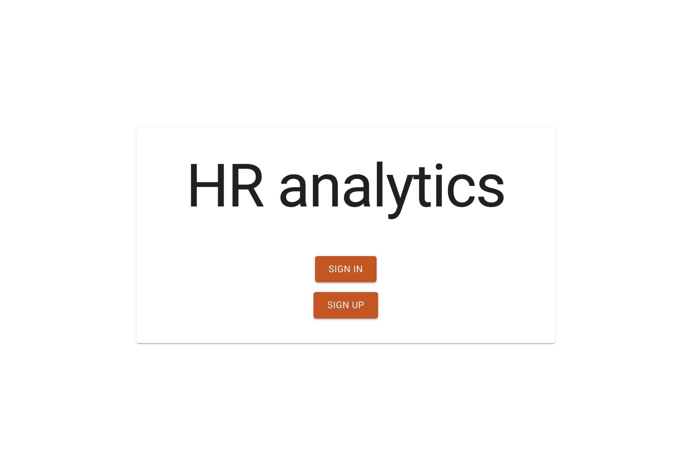

## Homepage
Stwórz branch na bazie gałęzi main:
`git checkout -b feature/homepage main`

## Subtaski
- Ustaw routing w aplikacji
    `Postaraj się to zrobić w taki sposób aby móc odwoływać się do routów za pomocą jakiejś zmiennej a nie za każdym razem za pomocą zwykłego stringa.`
- Tytuł strony w przeglądarce: `HR Dashboard`
- Strona powinna wyświetlać tytuł `HR Analytics` za pomocą tagu `h1`
- Strona powinna wyświetlić dwa przyciski, które na tę chwilę nic nie muszą robić ponieważ routy do nich jeszcze nie są gotowe na tym etapie.
    `Z racji tego, że te przyciski mają przekierowywać na inną stronę to spróbuj użyć linku, nie buttona.`
- Tytuł oraz przyciski powinny znajdować się w kontenerze który za pomocą `box-shadow` nada ładny cień
- Kontener powinien być wycentrowany

## Nice to have
- Zadbaj o wygląd dla urządeń mobilnych (np. na ekranach o szerokości 320px)

## Szacunkowa estymacja: 4h

## Przykłady
Mobile:

Desktop:

