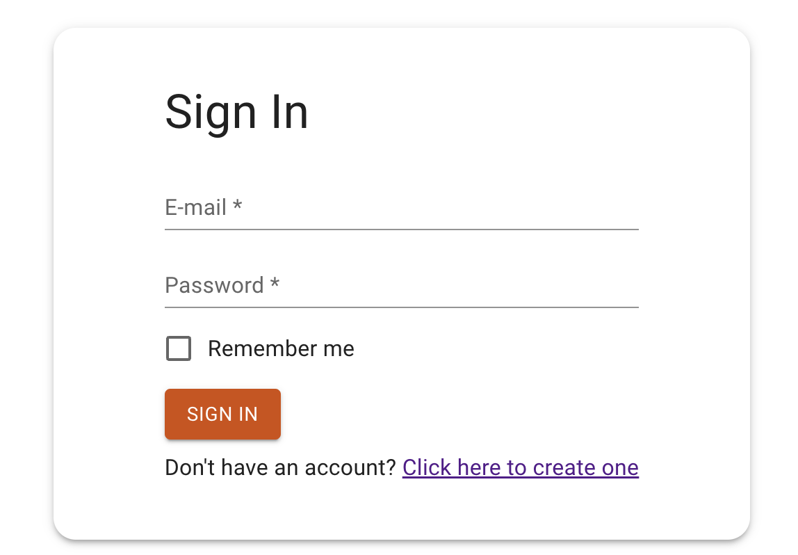

## Logowanie
Stwórz branch na bazie gałęzi main:
`git checkout -b feature/signin main`

## Subtaski
- Stwórz nowy route `/signin`
- Tytuł strony w przeglądarce: `HR Dashboard - Sign In`
- Dodaj przekierowanie na ten route za pomocą przycisku znajdującego się na stronie głównej z zadania 1
- Dodaj przekierowanie na ten route za pomocą linku z zadania 2
- Dodaj przekierowanie na ten route po poprawnej rejestracji
- Wyświetl kartę na środku ekranu
- W karcie znajduje się tytuł `h1` `Sign In`
- Pod tytułem wyświetla się formularz z 2 polami:
    - e-mail - odpowiednia walidacja dla adresów e-mail
    - hasło -  minimum 5 znaków, maksimum 15
- Każdy input wyświetla pod spodem błędy walidacji
- Pod inputami wyświetla się checkbox `Remember me`
    - jeżeli formularz zostanie wysłany z zaznaczonym checkboxem należy zapamiętać w przeglądarce token użytkownika w taki sposób aby po odświeżeniu strony użytkownik nadal był zalogowany
    - jeżeli nie zostanie zaznaczony to po odświeżeniu strony użytkownik jest wylogowany
- Na końcu formularza wyświetla się przycisk `SIGN IN`, który wysyła formularz
- Wysyłka formularza polega na wysłaniu odpowiedniego requestu w celu zalogowania użytkownika
`POST /auth/login`
PAYLOAD:
```
{
    "email": string,
    "password": string
}
```
W odpowiedzi otrzymasz access token który będzie Ci potrzebny do autoryzacji przy kolejnych requestach do API.
W związku z tym powinieneś zapisać token tak aby mieć do niego dostęp z innych miejsc w kodzie. Można to osiągnąć np. za pomocą contextu.
- Na samym dole karty wyświetla się tekst `Don't have an account? Click here to create one`, gdzie `Click here to create one` to link przekierowujący na stronę rejestracji

## Nice to have
- Obsługa błędu z api za pomocą czerwonego alertu pod formularzem

## Szacunkowa estymacja: 6h

## Przykłady:

